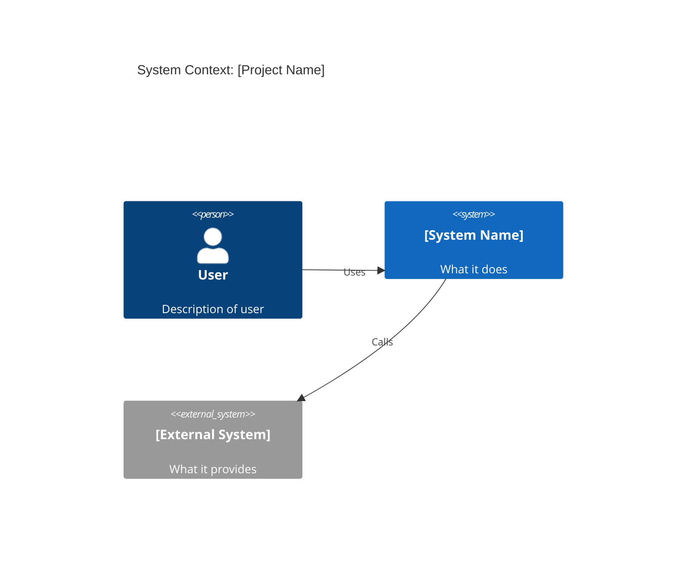

# Cross-Cutting Documentation Standards

These standards apply across all project types. Apply them regardless of which project-type guide is in use.

---

## 1. Diataxis Framework

Reference: https://diataxis.fr/

Classifies all documentation into four distinct types based on user need. **Never mix these types** — mixing is the most common cause of confusing documentation.

| Type | User need | Orientation | What to write |
|------|-----------|-------------|---------------|
| **Tutorial** | Learning | Acquisition | Step-by-step walkthrough for a new user. Teaches by doing. |
| **How-to Guide** | Solving a problem | Action | Recipe for achieving a specific goal. Assumes competence. |
| **Reference** | Looking up facts | Information | Dry, accurate description of a system. API docs, CLI options. |
| **Explanation** | Understanding | Comprehension | Background, rationale, design decisions. The "why". |

**When to apply:**
- For medium/large projects, organize `docs/` using these four categories
- For any project with more than a README, check that content is in the right category
- When generating "why" documentation, that content belongs in `explanation/`
- Per-file and API docs belong in `reference/`

---

## 2. Architecture Decision Records (ADRs)

Reference: https://adr.github.io/

Short, immutable records of significant architectural decisions. Use **MADR format** (recommended over the minimal Nygard template).

**Storage convention:** `docs/decisions/` numbered sequentially: `0001-use-postgresql.md`

### MADR Template

```markdown
---
status: accepted          # proposed | accepted | deprecated | superseded
date: [YYYY-MM-DD]
decision-makers: [names]
---

# [Short noun-phrase title of the decision]

## Context and Problem Statement

[Why was this decision needed? What problem were we solving?]

## Considered Options

- Option A: [name]
- Option B: [name]
- Option C: [name]

## Decision Outcome

Chosen: **Option A**, because [justification].

### Consequences

- Good: [positive outcome]
- Good: [positive outcome]
- Bad: [negative tradeoff accepted]

## Pros and Cons of the Options

### Option A

- Good: [reason]
- Bad: [reason]

### Option B

- Good: [reason]
- Bad: [reason]
```

**When to create an ADR from code:**
- Non-obvious technology choices (`# we use X instead of Y because...`)
- `HACK:` or `# workaround:` comments explaining constraints
- Feature flags that represent a transition decision
- `legacy` / `deprecated` / `compat` code — document what it's replacing and why it still exists
- Unusual patterns — if a pattern looks like it could be simpler, document the constraint

---

## 3. Keep a Changelog

Reference: https://keepachangelog.com/en/1.0.0/

Standard format for `CHANGELOG.md`. If the project doesn't have one and is versioned, recommend creating it.

**Required structure:**

```markdown
# Changelog

All notable changes to this project will be documented in this file.

The format is based on [Keep a Changelog](https://keepachangelog.com/en/1.0.0/),
and this project adheres to [Semantic Versioning](https://semver.org/spec/v2.0.0.html).

## [Unreleased]

## [1.2.0] - 2025-11-15

### Added
- New feature or capability

### Changed
- Change to existing behavior

### Deprecated
- Something that will be removed in a future version

### Removed
- Feature that was removed

### Fixed
- Bug that was fixed (#issue-number)

### Security
- Vulnerability patched (CVE reference if applicable)
```

**Six change types only:** Added, Changed, Deprecated, Removed, Fixed, Security.

---

## 4. standard-readme

Reference: https://github.com/RichardLitt/standard-readme/blob/main/spec.md

README structure specification. Every project should follow this order:

**Required sections (in order):**

| Section | Notes |
|---------|-------|
| Title | Must match repo/package name |
| Badges | CI status, version, license |
| Short Description | Under 120 chars, no heading |
| Table of Contents | Required unless README < 100 lines |
| Background | Context and motivation |
| Install | Code block; Dependencies subsection if needed |
| Usage | Common invocation examples |
| Contributing | How to contribute, PR process |
| License | SPDX identifier; must be final section |

When generating or evaluating a README, check it follows this order.

---

## 5. C4 Model (Architecture Diagrams)

Reference: https://c4model.com/

Four levels of architecture diagrams. Use **Level 1 and Level 2** for project documentation — Level 3 and 4 are optional.

| Level | Shows | Audience | When to generate |
|-------|-------|----------|-----------------|
| L1: System Context | The system, its users, external systems | Non-technical | Always |
| L2: Container | Deployable units (apps, DBs, queues) | Technical team | Medium/large projects |
| L3: Component | Internal structure of a container | Developers | Optional |
| L4: Code | Class/function level | Engineers | Skip — too volatile |

**Mermaid C4 syntax for generated diagrams:**



---

## Applying Standards to Generated Reports

| Standard | Apply when |
|----------|-----------|
| Diataxis | Organizing `docs/` for medium/large projects |
| MADR ADRs | Non-obvious decisions found in code; `HACK` comments; legacy code |
| Keep a Changelog | Project has versions but no `CHANGELOG.md` |
| standard-readme | README is missing sections or poorly structured |
| C4 Model | Architecture section in overview.md; medium/large projects |
