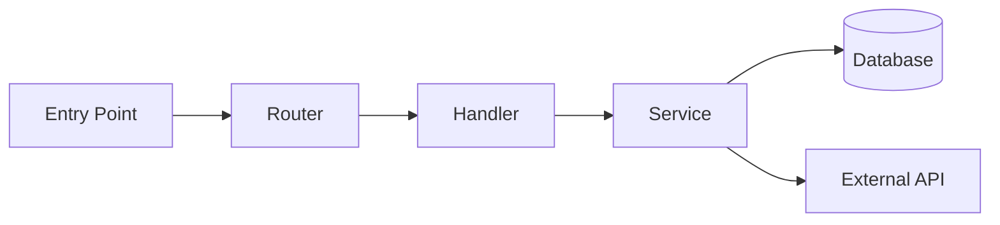

# Documentation Templates

Templates for consistent documentation output. Adapt to project context — remove sections that don't apply.

---

## Project Overview Template

Use for `PROJECT_DOCS.md` (small projects) or `docs/overview.md` (medium/large).

```markdown
# [Project Name] — Documentation

> [One sentence: what this project does and for whom]

Generated: [date]

---

## What This Project Does

[2-4 sentences explaining the project's purpose, the problem it solves, and who uses it]

## Architecture

[ASCII diagram or mermaid diagram showing how components relate]

**Key components:**
- `[component]` — [what it does]
- `[component]` — [what it does]

## Entry Points

| File | Purpose |
|------|---------|
| `[file]` | [what happens when you run it] |

## Technology Stack

| Layer | Technology | Why |
|-------|-----------|-----|
| [layer] | [tech] | [reason inferred from code/config] |

## Key Data Flows

[Describe 1-3 important flows through the system, e.g., "A request comes in → auth middleware → handler → database → response"]

---

## File Reference

[List of all source files with their documentation — see per-file template below]

---

## Architectural Decisions

[See decisions template below]
```

---

## Per-File Documentation Template

For each source/entry file. Keep concise — 5-15 lines per file is the target.

```markdown
### `[relative/path/to/file.py]`

**Purpose:** [One sentence — what this file is responsible for]

**Why it exists:** [Why this was written — inferred from code, comments, or git history]

**Key exports / public API:**
- `[FunctionName(args)]` — [what it does]
- `[ClassName]` — [what it represents]

**Dependencies:** [Notable imports that reveal what this file relies on]

**Notes:** [Anything non-obvious — gotchas, known issues, future plans mentioned in comments]
```

### Minimal variant (for simple/obvious files)

```markdown
### `[path/to/file.py]`

[One sentence purpose.] [One sentence about key exports if non-obvious.]
```

---

## Architecture Diagram Templates

### Simple (ASCII)

```
┌─────────────┐     ┌─────────────┐     ┌─────────────┐
│   Client    │────▶│   Server    │────▶│  Database   │
└─────────────┘     └─────────────┘     └─────────────┘
                           │
                    ┌──────┴──────┐
                    │    Cache    │
                    └─────────────┘
```

### Mermaid (use when project has clear data flow)



---

## Architectural Decision Record (ADR) Template

Use for each non-obvious decision discovered in code. Collect these in `docs/decisions.md`.

```markdown
## ADR: [Short title of the decision]

**Status:** [Implemented / Superseded / Proposed]

**Context:**
[Why was this decision needed? What problem was being solved?]

**Decision:**
[What was decided?]

**Evidence in code:**
- `[file:line]` — [what the code shows]
- Comment: "[relevant comment from code]"

**Consequences:**
[What does this decision enable or constrain?]

**Alternatives considered:**
[If visible from code comments or git history — what else was considered and why rejected]
```

---

## CLAUDE.md Update Template

When the skill completes, update or create the project's CLAUDE.md:

```markdown
# [Project Name]

## What This Project Does

[1-2 sentences from the overview]

## Architecture

[Key architectural pattern identified]

**Important files:**
| File | Role |
|------|------|
| `[entry]` | [purpose] |
| `[key source]` | [purpose] |
| `[key config]` | [purpose] |

## Tech Stack

[Languages and key frameworks]

## How to Run

[Extracted from README, Makefile, or package.json scripts]

## Key Conventions

[Naming patterns, coding style, organizational patterns observed]

## Documentation Generated

[Date] — `document-everything` skill generated docs in `[location]`
```

---

## Output Size Guidance

| Project Size | Source Files | Recommended Output |
|-------------|-------------|-------------------|
| Small | < 20 | Single `PROJECT_DOCS.md` in project root |
| Medium | 20–100 | `docs/overview.md` + `docs/files.md` + `docs/decisions.md` |
| Large | 100+ | `docs/` directory with per-module files |

For **large** projects, organize docs by module/package rather than per-file:
```
docs/
├── overview.md
├── modules/
│   ├── auth.md
│   ├── api.md
│   └── database.md
└── decisions.md
```
