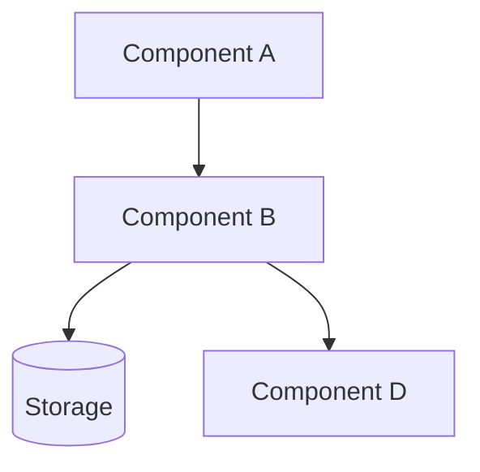
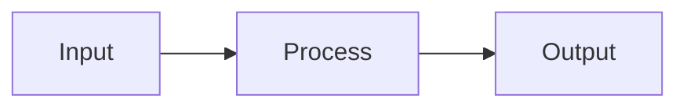
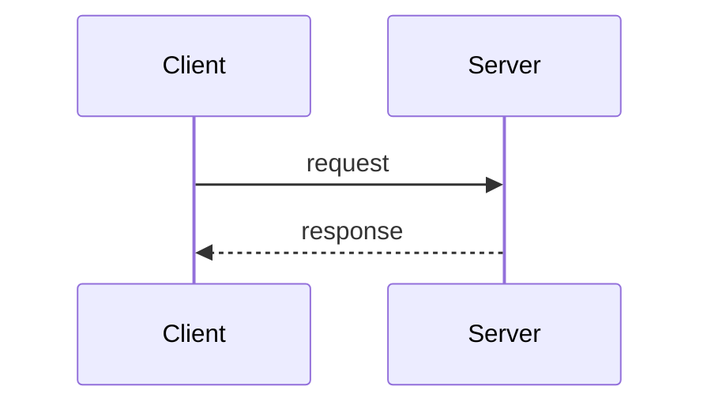
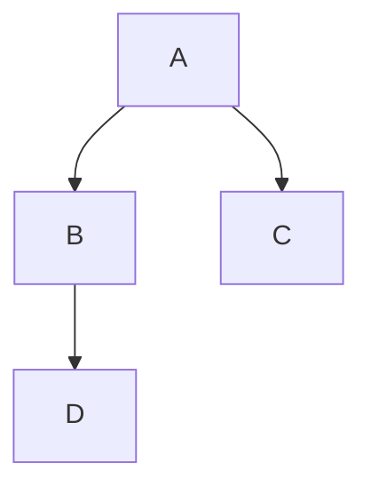
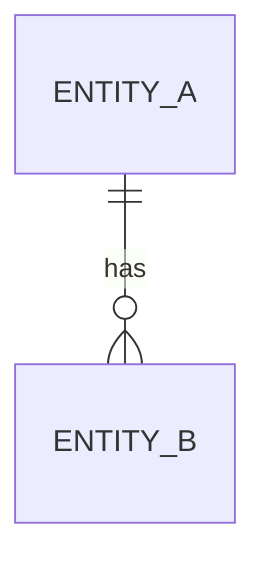
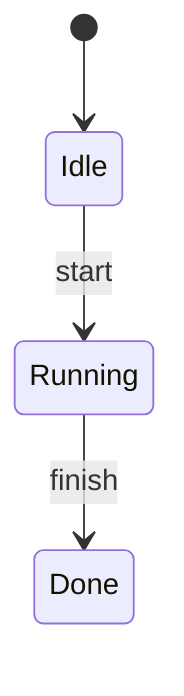

# Documentation Report Templates

Standardized Nextflow-inspired report format. All project types use the same structural skeleton — only section content varies. See `project-types/` for type-specific section guidance.

---

## Standard Report Structure

Every report follows this structure, regardless of project type or size:

```markdown
# [Project Name] · Documentation Report

> [One sentence: what this project does]

| | |
|---|---|
| **Type** | [project_type from manifest] |
| **Generated** | [date] |
| **Language(s)** | [languages] |
| **Source files** | [count] |
| **Repository** | [git_remote or —] |

---

## Summary

[3-5 sentences covering: purpose, who uses it, what problem it solves, and the core approach]

---

## Architecture

Generate a **Mermaid architecture diagram** showing top-level components and how data or control flows between them. Use `graph TD` for top-down layouts or `graph LR` for left-right pipelines.



**Components:**

| Component | Location | Responsibility |
|-----------|----------|----------------|
| [name] | `[path]` | [what it does] |

---

## Diagrams

Generate **3–5 Mermaid diagrams** spread across the report. Each diagram must be meaningful — skip a type if it doesn't apply to this project. Prefer diagrams over prose for showing relationships and flows.

### Required diagram types (use what applies)

**1. Data flow** — how data moves through the system end-to-end:


**2. Sequence diagram** — key interactions between components over time:


**3. Component/dependency graph** — what depends on what:


**4. Entity relationship** (for data-heavy or library projects):


**5. State machine** (for CLI tools, pipelines, or stateful services):


Place diagrams inline within the relevant section (architecture diagram in the Architecture section, sequence diagram near Entry Points or the type-specific section, etc.). Do **not** group all diagrams into a single "Diagrams" section.

---

## Entry Points

| File | Invocation | Purpose |
|------|-----------|---------|
| `[path]` | `[how to run]` | [what it starts] |

---

## [Type-Specific Section(s)]

[See project-types/ reference for what goes here — processes, routes, components, commands, etc.]

---

## Configuration

| Parameter | Location | Purpose | Default |
|-----------|----------|---------|---------|
| [name] | `[file]` | [what it controls] | [value or —] |

---

## Dependencies

| Dependency | Version | Why |
|-----------|---------|-----|
| [name] | [version] | [inferred purpose] |

---

## File Reference

[Per-file entries — see per-file template below]

---

## Architectural Decisions

[ADR entries — see ADR template below]

---

## Known Issues & Technical Debt

| Location | Issue | Severity |
|----------|-------|---------|
| `[file:line]` | [description from TODO/FIXME/HACK comment] | [low/medium/high] |

*Only include if TODO/FIXME/HACK comments are found in the code.*
```

---

## Per-File Entry Template

One entry per source/entry file. Keep to 5–10 lines.

```markdown
### `[relative/path/to/file]`

**Purpose:** [One sentence]

**Why it exists:** [Inferred from code, comments, or git history]

**Key exports:**
- `[Symbol]` — [what it does]

**Notes:** [Gotchas, known issues, non-obvious constraints]
```

Minimal variant for simple/obvious files:

```markdown
### `[path/to/file]`

[One sentence purpose. Key export if non-obvious.]
```

---

## ADR Template

```markdown
### [Short decision title]

**Context:** [Why this decision was needed]

**Decision:** [What was chosen]

**Evidence:** `[file:line]` — [what the code shows]

**Consequence:** [What this enables or constrains]
```

---

## Output Size Rules

| Size class | Source files | Output location |
|-----------|-------------|----------------|
| `small` | < 20 | `PROJECT_DOCS.md` at project root |
| `medium` | 20–100 | `docs/overview.md` + `docs/files.md` + `docs/decisions.md` |
| `large` | > 100 | `docs/overview.md` + `docs/modules/[name].md` + `docs/decisions.md` |

For `large` projects, group files by top-level directory into module files instead of one entry per file.

---

## CLAUDE.md Update Template

```markdown
## [Project Name] — Auto-generated Summary

**What it does:** [1-2 sentences]

**Project type:** [type] | **Stack:** [languages/frameworks]

**Key files:**
| File | Role |
|------|------|
| `[path]` | [purpose] |

**How to run:** `[command from README/Makefile/package.json]`

**Docs generated:** [date] → `[output location]`
```

Add this as a new section at the bottom of an existing CLAUDE.md. Never overwrite existing content.
